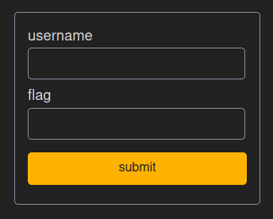
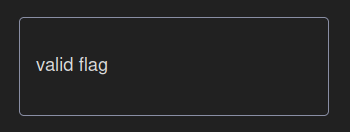
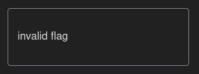
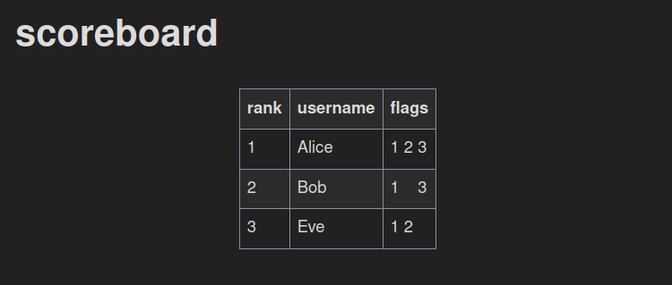

# Documentation
## Deployment
Challenges are defined in `db/init.sql`. They will only be added to the database on first run.

If you modified `db/init.sql`, delete `db/db.sqlite3`. `simple-scoreboard` will recreate it with the new challenges next time it runs.

## Usage
### Submit a flag
Flag submission happens on `/`. Provide a username and a flag to submit it.

All submissions with the same username (case-sensitive) will awards points on the scoreboard to that username.

|Flag submission|Valid flag|Invalid flag|
|-|-|-|
||||

### Scoreboard
The scoreboard is displayed on `/scoreboard`. It shows the user's rank, its name and the flags they collected.

#### Ranking
The ranking assumes the challenges are ordered from easiest to hardest in `db/init.sql`. Each challenge is awarded a number of points equivalent to its id. All users get sorted by their amount of points and, in the event of a tie, the timestamp of their last submission.